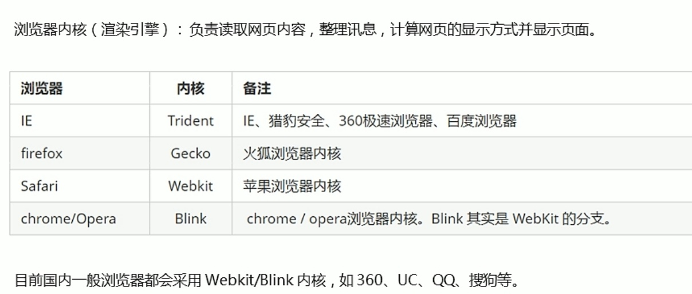
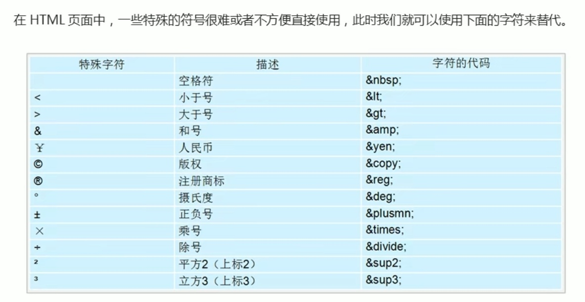
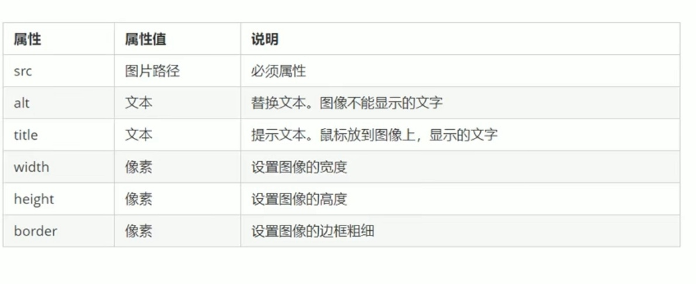

# HTML标签


<!--more-->

## 网站与网页

1. 网页是网站的一部分（网站是网页的集合），通常是HTML格式的文件，需要通过浏览器来阅读。

2. 网页是构成网站的基本元素，通常由图片，链接，文字，声音，视频等元素组成。网页常是以.html或.htm后缀结尾的文件，因此俗称html文件。

3. （HTML：超文本标记语言，网页的标准语言。HTML并不是一门编程语言，而是一门描述性的标记语言）

## 浏览器

1. 五大浏览器：IE，谷歌，火狐，edge，sufari

2. 浏览器内核（了解）：

## web标准

1. 由w3c组织和其他标准化组织指定的一系列标准的集合，遵循web标准使得不同开发人员写出的页面更加统一。

2. web标准的构成（三者相互分离）：


## html标签:
### 标签分类及结构

1. 双标签：

 ```html
 <html> </html>  
 ```

2. 单标签：

 ```html
  <br />
 ```

3. 包含关系

``` html
<head>
    <title></title>
</head>
```

4. 并列关系

```html
<head></head>
<body></body>
```

5. 网页基本结构骨架：

```html
<!DOCTYPE html>//文档声明标签
<html lang="en">//文档显示语言标签:
<head>
    <meta charset="UTF-8">//通过<meta>标签的chrset属性规定文档使用的字符编码方式
    <meta http-equiv="X-UA-Compatible" content="IE=edge">
    <meta name="viewport" content="width=device-width, initial-scale=1.0">
    <title>用vscode创建网页</title>
</head>
<body>
    abababaababababab
</body>
</html>
```
### 常用标签

1. 标题标签

```html
    <h1>一级标题</h1>
    <h2>二级标题</h2>
    <h3>三级标题</h3>
    <h4>四级标题</h4>
    <h5>五级标题</h5>
    <h6>六级标题</h6>
```

2. 段落与换行标签(不同段落之间会有间隙，但强制换行没有间隙)

```html
	<p>第一段阿巴阿巴</p>
    <p>第二段阿巴阿巴</p>
    <p>第二段(强制换行)<br/>阿巴阿巴</p>
```

3. 文本格式化标签


```html
	<strong>加粗1</strong>
    <b>加粗2</b>
    <em>倾斜1</em>
    <i>倾斜2</i>
    <del>删除线1</del>
    <s>删除线2</s>
    <ins>下划线1</ins>
    <u>下划线2</u>
```
4. 注释标签 （ctrl+/）与特殊字符

```html
<!--此为注释-->
```



> <!--<div>和<span>->标签（无语义，用于布局）

```html
	<div>第一个盒子，div独占一行</div>
    <span>第二个盒子，span可放多个</span>
    <span>第三个盒子</span>
```

5. 图像标签(设置宽高时如果只改变一个则纵横比不变)



``` html
<image src="文件路径2" alt="此为图像无法显示时的替换文本" title="鼠标移动到图片上的提示文本" width="500" height="100" border="15"/>
```

6. 超链接标签（由一个页面链接到另一个页面）

```html
	<!----<a herf="跳转的链接地址" target="目标窗口的打开方式_self为默认模值，_blank为在新窗口打开">文本或图像</a>--->
    <!--1.外部链接:访问外部的qi'ta-->
    <br/>
    <a href="http://www.baidu.com" target="_blank">百度</a>
    <a href="http://www.qq.com">腾讯</a>
	<!--2.内部链接:访问网站内部的其他页面，直接链接内部页面名称即可-->
    <a href="vscode创建页面.html">例子</a>
    <!--3.空链接:用于占位，链接地址为空-->
    <a href="#">空链接</a>
    <!--4.下载链接:用于下载文件，可直接链接文件地址-->
    <a href="img.zip">下载文件</a>
	<!--网页元素链接：链接的内容不仅仅可以是文字，也可以是其他的网页元素，如文本/表格/音频/视频-->
    <a href="http:www.baidu.com"></a>
    <!--锚点链接:用于网页中某些位置的跳转，<1>.在href中设置#名字A<2>在目标位置标签中添加一个id属性=名字A-->
    <a href="#锚点1">锚点一</a>
    <h3 id="锚点1">锚点一详情</h3>
```

7. 表格标签（用于显示数据）

- table标签创建表格，tr标签创建行，td标签创建相关单元格。对于表格第一行的单元格，使用th代替td作为表头标签进行突出

- 表格属性一般在css中进行设置，此处做了解


- 表格结构标签：由于表格可能很长，因此将表格分为头部<thead>与主体<tbody>两大部分可以更好地表示表格语义

```html
<!-- 表格 -->
    <table> 
        <thead>
        <tr><th>姓名</th> <th>性别</th> <th>年龄</th></tr>
        </thead>
        <tbody>
        <tr><td>aa</td> <td>男</td> <td>11</td></tr>
        <tr><td>bb</td> <td>男</td> <td>12</td></tr>
        <tr><td>cc</td> <td>男</td> <td>15</td></tr>
        </tbody>
    </table>
```

- 合并单元格（跨行colspan与跨列rowspan）

先找到目标单元格，按照跨行/列合并添加属性（数字代表合并单元格个数），再删掉多余行


```html
<!-- 合并单元格 -->
    <table width="500" heigth="249" border="1" cellspacing="0"> 
        <thead>
        <tr><th>姓名</th> <th>性别</th> <th>年龄</th></tr>
        </thead>
        <tbody>
        <tr><td>aa</td> <td colspan="2">男</td></tr>
        <tr><td rowspan="2">bb</td> <td>男</td> <td>12</td></tr>
        <tr><td>男</td> <td>15</td></tr>
        </tbody>
    </table>
```

8. 列表标签（用于布局页面）


``` html
    <!-- 列表标签(相关属性在css中设置) -->
    <!-- 无序(ul中只可放li，li中可放其他元素) -->
    <ul>
        <li>lll</li>
        <li>lol</li>
        <li><p>123</p></li>
    </ul>
    <!-- 有序(了解,0l中只可放li，li中可放其他元素) -->
    <ol>
        <LI>no.1</LI>
        <LI>no.2</LI>
        <LI>no.3</LI>
    </ol>
    <!-- 自定义(dl中只可放dt或dd（个数不限），dd或dt中可放其他元素) -->
    <dl>
        <dt>名词1</dt>
        <dd>名词1解释1</dd>
        <dd>名词1解释2</dd>
    </dl>
```

9. 表单标签（用于收集用户信息，由表单域form，表单控件（表单元素）及提示信息3部分组成）


```html
    <!-- 1.表单域标签<form> -->
    <form action="url地址" method="提交方式" name="表单域名称，用于区别不同表单">
	</form>
```

```html
 <!-- 2.表单元素标签 -->
        <!-- 2.1 input标签（不同type属性及其他属性） -->

        <!-- 文本框 -->
        <!-- value为值，规定了输入元素的值 -->
        <!-- maxlength规定了输入元素的最大长度 -->
        用户名：<input type="text" name="username" value="请输入用户名" maxlength="4"><br/>

        <!-- 密码框 -->
        密码：<input type="password" name="pwd" maxlength="6"><br/>

        <!-- 单选和多选可设置checked属性，当页面打开时默认选中这个选项（多选中可以设置一个以上） -->

        <!-- 单选 -->
        <!-- name为表单元素的名字，此处单选name必须一致才可保证单选 -->
        性别：男<input type="radio" name="sex" checked="checked">女<input type="radio" name="sex"><br/>
        
        <!-- 多选 -->
        爱好：吃饭<input type="checkbox" name="hobby" checked="checked">睡觉<input type="checkbox" name="hobby" checked="checked">喝水<input type="checkbox" name="hobby"><br/>
        
        <!-- 提交：将表单域中的值提交给后台服务器 -->
        <input type="submit" value="提交">

        <!-- 重置：将表单域中的值重置为初始状态 -->
        <input type="reset" value="重置">

        <!-- 普通按钮：可点击，用于通过js启动脚本 -->
        <input type="button" value="获取短信验证码">
        
        <!-- 文件域：用于上传文件 -->
        上传文件：<input type="file">
```

```html
<!-- 2.2 label标签(不是表单元素但常与input一起用)：用于绑定表单元素，点击标签内的文本，自动将光标转到对应的表单元素（for属性和对应元素id相同）上，用于优化用户体验 -->
        性别:<label for="sex">男</label><input type="radio" name="sex" id="sex">
```

```html
<!-- 2.3 select标签：给用户提供下拉列表中的选项 -->
        籍贯：
        <select>
            <option>北京</option>
            <option>上海</option>
            <option>深圳</option>
            <option selected="selected">河南</option>
        </select>
```

```html
<!-- 2.4 textarea文本域标签（其中的row和col一般在开发中不会使用，一般用css控制行列） -->
        文本域：<textarea rows="3" cols="20">这些是打开页面时默认的文本内容
        </textarea>
```

10. 相对路径与绝对路径

- 相对路径：一引用文件夹所在位置为参考基础而建立的目录路径


- 绝对路径：指目录下的绝对位置，通常从盘符开始的路径


